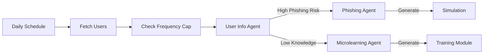

# Agentic Ally - Platform Overview

**Last Updated:** February 3, 2026

## 🛡️ What is Agentic Ally?

**Agentic Ally** is an Autonomous Security Awareness Platform powered by a **Multi-Agent System**.

Unlike traditional tools that just send emails, Ally employs a team of **6 Specialized AI Agents** to analyze user behavior, detect knowledge gaps, and proactively generate personalized training and simulations.

It operates in two modes:
1.  **Reactive:** Developers/Admins chat with the Orchestrator to generate content on demand.
2.  **Proactive:** The Autonomous Service runs on a schedule to "heal" the organization's security posture automatically.

---

## 🤖 The 6 Specialist Agents

### 1. Orchestrator Agent (The Router)
*   **Role:** The intelligent front-desk.
*   **Capabilities:** Analyzes user intent, checks conversation history, and routes requests to the correct specialist. It acts as a stateless "Detective" to figure out *who* needs *what*.

### 2. Microlearning Agent (The Educator)
*   **Role:** Generates 5-minute interactive training modules.
*   **Capabilities:**
    *   Creates 8-scene courses (Intro -> Video -> Quiz -> Action).
    *   Finds relevant videos via Semantic Search.
    *   Generates content in 12+ languages.

### 3. Phishing Agent (The Simulator)
*   **Role:** Tests users with realistic attacks.
*   **Capabilities:**
    *   Uses **Cialdini's 6 Principles of Persuasion**.
    *   Generates deceptive Emails and Landing Pages.
    *   Personalizes attacks based on target department (e.g., "Invoice" for Finance).

### 4. User Info Agent (The Analyst)
*   **Role:** Understands the human element.
*   **Capabilities:**
    *   Analyzes user activity timelines.
    *   Calculates a **Risk Score** (Low/Med/High).
    *   Suggests appropriate training levels (Beginner vs Advanced).

### 5. Policy Agent (The Expert)
*   **Role:** RAG-based policy answering.
*   **Capabilities:**
    *   Retrieves company policy documents.
    *   Summarizes complex legalese into actionable HTML bullet points.
    *   Answers "What is our policy on X?" questions instantly.

### 6. Email IR Analyst (The Incident Responder)
*   **Role:** Automated email incident response.
*   **Capabilities:**
    *   Analyzes headers, body intent, and behavioral signals.
    *   Triages suspicious emails into SOC-friendly categories.
    *   Produces a full IR report with risk level, confidence, and recommended actions.

---

## 🔄 How It Works

### The Autonomous Loop (Proactive)


### The Chat Interface (Reactive)
```
User: "Create a phishing test for the IT team."
  ↓
Orchestrator: "Intent detected: Create Simulation. Target: IT."
  ↓
Phishing Agent: "Generating 'VPN Update' scenario for IT..."
  ↓
Result: Ready-to-deploy Simulation URL.
```

---

## 🏗️ Technical Architecture

*   **Framework:** Mastra 0.21.x (The Brain)
*   **Runtime:** Cloudflare Workers (The Muscle)
*   **Storage:** Cloudflare KV (Content) + D1 (Vectors)
*   **AI Models:** OpenAI `gpt-4o` + Workers AI

### Resilience First
We adhere to a stric **3-Level Fallback Protocol**. If the smartest method (e.g., Tensor Search) fails, we degrade to Heuristics, then to Hardcoded Defaults. The system **never crashes**.

---

## 🚀 Key Features

*   **Unlimited Languages:** Auto-detects and generates content in any language (BCP-47).
*   **Self-Healing:** Generated JSON is validated by Zod; failures are auto-repaired.
*   **Secure by Design:** No personal identifiers in LLM outputs. Strict output sanitization.
*   **Visual:** "Canvas" UI signals allow the frontend to open editors instantly.

---

## 📚 Documentation Map

| File | Purpose |
|------|---------|
| [**HANDOVER.md**](./HANDOVER.md) | **Start Here.** Critical configs and roadmap. |
| [**ARCHITECTURE.md**](./ARCHITECTURE.md) | Deep dive into the Agent System design. |
| [**DEVELOPMENT.md**](./DEVELOPMENT.md) | How to run and debug locally. |
| [**DATA_MODEL.md**](./DATA_MODEL.md) | Database schemas and types. |
