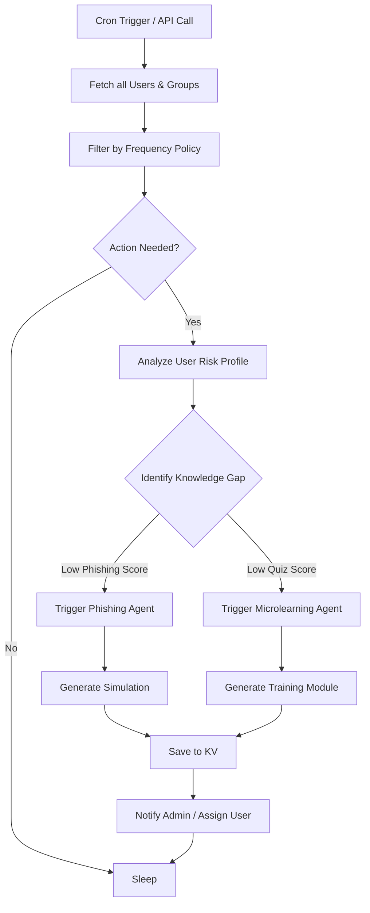
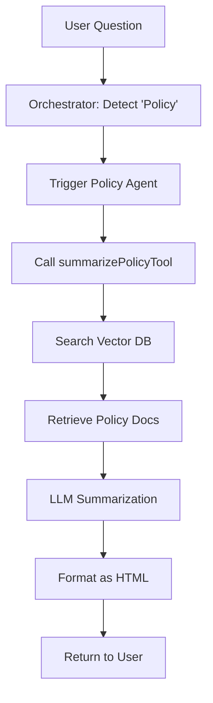
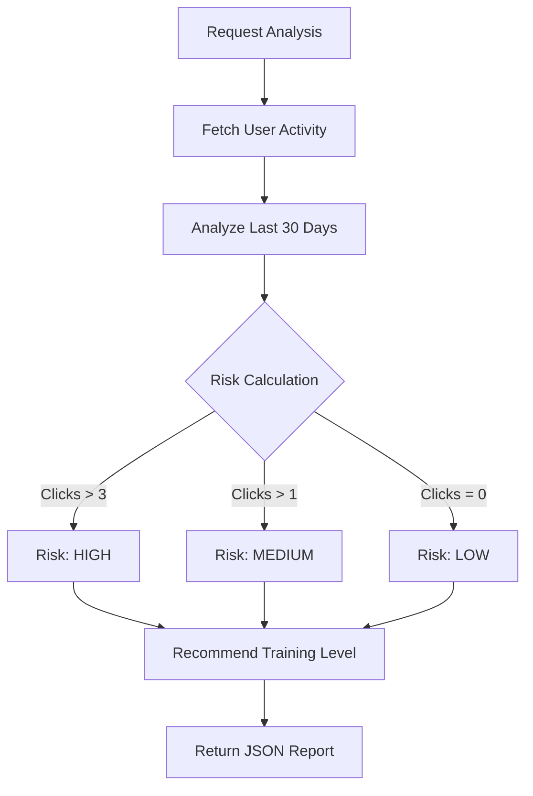
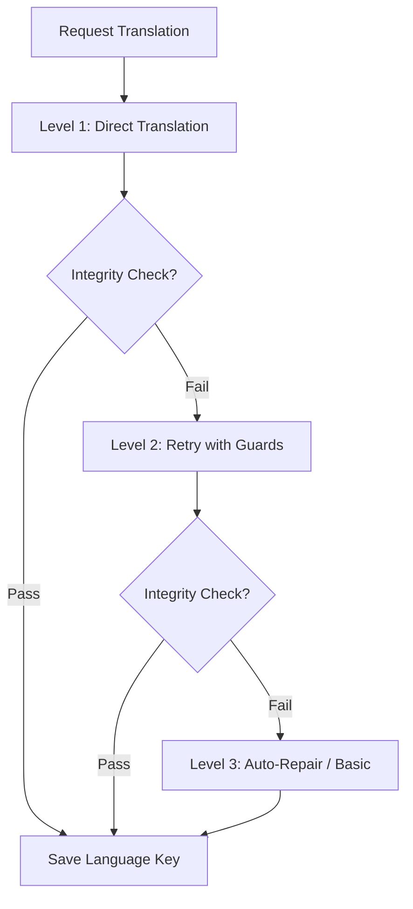

# Workflow Documentation

**Last Updated:** January 10, 2026

This document visualizes the core logic flows of the Agentic Ally system.

---

## 1. Autonomous Workflow (The Loop)

This runs on a schedule (Cron) to proactively generate content.



---

## 2. Create Microlearning Workflow

The complex process of generating a 5-minute training module.

```mermaid
graph TD
    Start[User Request] --> State1[State 1: Gather Requirements]
    State1 --> Confirm{User Confirmed?}
    
    Confirm -->|No| State1
    Confirm -->|Yes| State3[State 3: Execute]
    
    State3 --> Parallel{Parallel Execution}
    
    Parallel --> Structure[Gen Structure (JSON)]
    Parallel --> Inboxes[Gen Inbox Variants]
    
    Structure --> Enhance[Enhance Content (Rich Text)]
    Enhance --> Video[Semantic Search Video]
    
    Video --> Merge[Merge All Components]
    Inboxes --> Merge
    
    Merge --> Validate[Zod Code Validation]
    
    Validate -->|Fail| repair[Auto-Repair JSON]
    repair --> Validate
    
    Validate -->|Pass| Save[Save to KV]
    Save --> State4[State 4: Complete]
```

---

## 3. Phishing Simulation Workflow

Generating a realistic attack scenario.

```mermaid
graph TD
    Start[Agent Request] --> Persona[Analyze User Persona]
    
    Persona --> Tactics{Select Tactics}
    Tactics -->|Urgency| T1[Template: Immediate Action]
    Tactics -->|Curiosity| T2[Template: "Look at this"]
    Tactics -->|Authority| T3[Template: CEO Request]
    
    T1 & T2 & T3 --> GenEmail[Generate Email Body]
    GenEmail --> GenLanding[Generate Landing Page]
    
    GenLanding --> Sanitize[Sanitize Output]
    Sanitize --> Save[Save to KV]
```

---

## 4. Policy Expert Workflow

How the system answers policy questions (RAG).



---

## 5. User Risk Analysis Workflow

How we determine if a user needs training.



---

## 6. Localization Workflow (3-Level Fallback)

How we translate content without breaking it.


