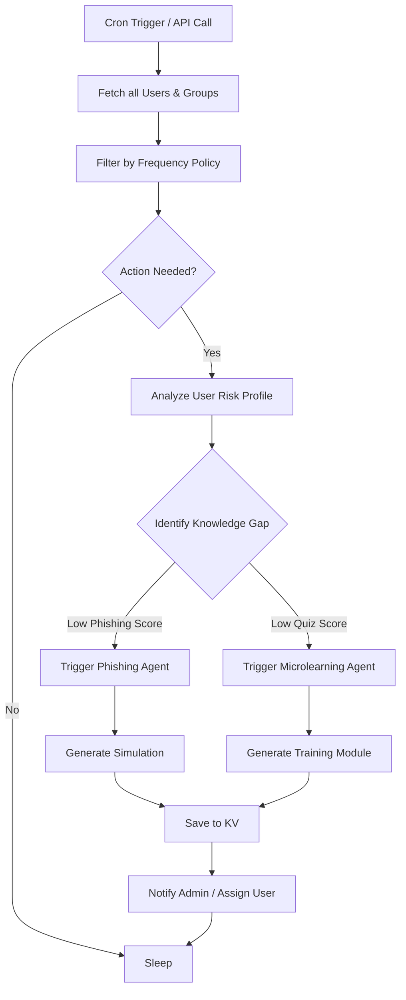
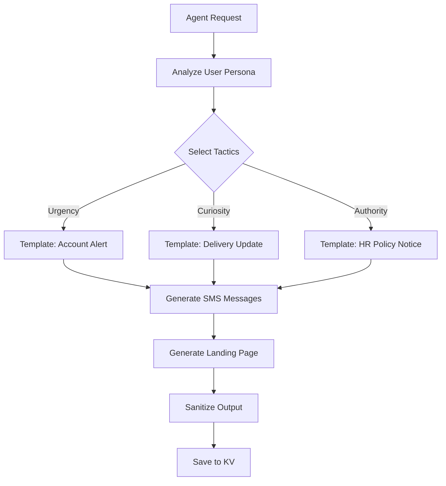
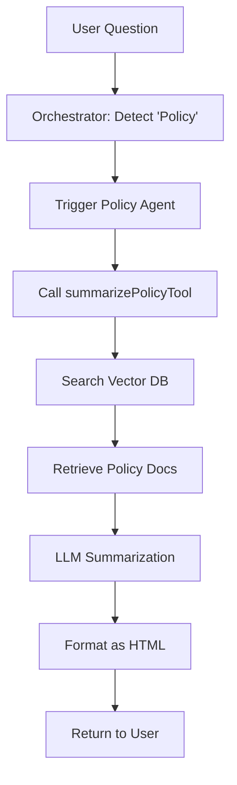
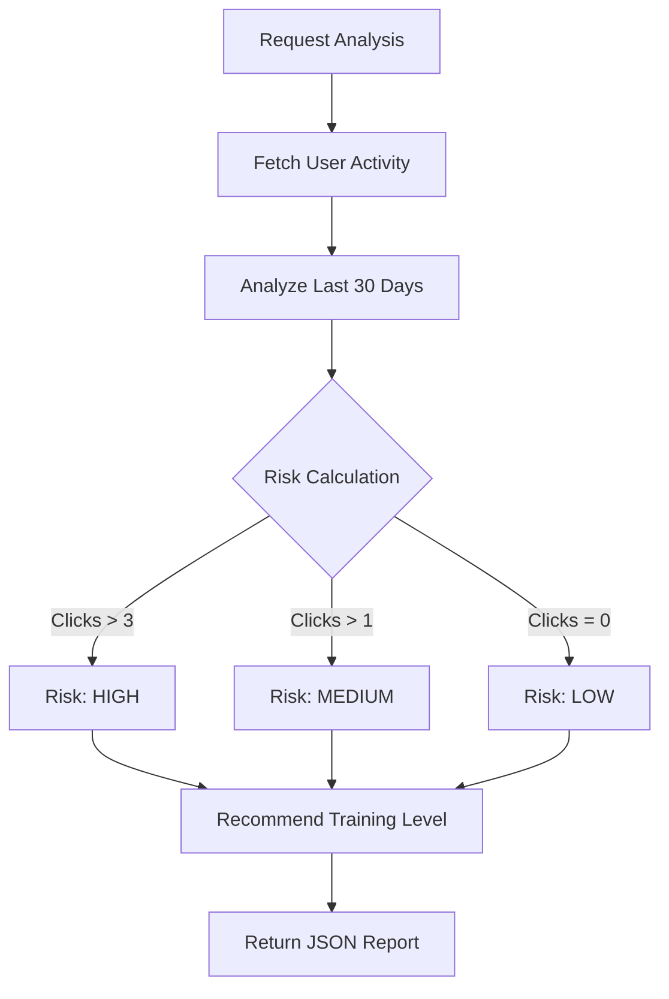
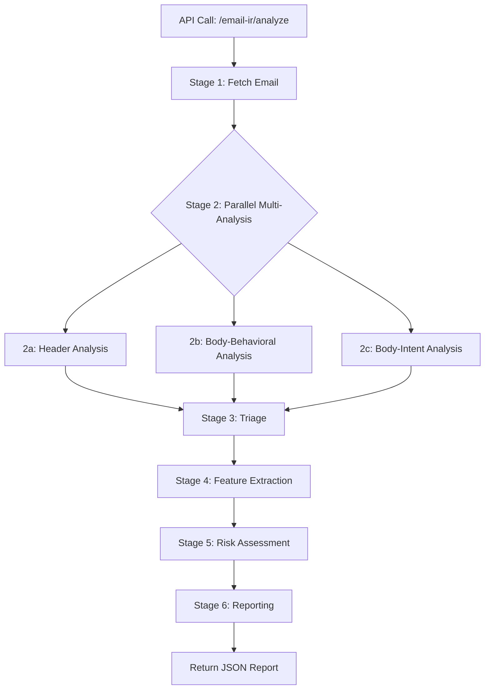
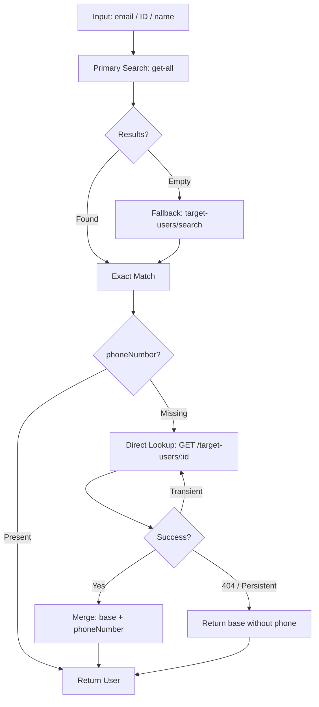
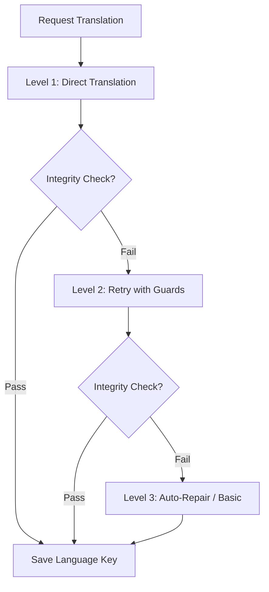

# Workflow Documentation

**Last Updated:** February 16, 2026

This document visualizes the core logic flows of the Agentic Ally system.

---

## 1. Autonomous Workflow (The Loop)

This runs on a schedule (Cron) to proactively generate content.



---

## 2. Create Microlearning Workflow

The complex process of generating a 5-minute training module.

```mermaid
graph TD
    Start[User Request] --> State1[State 1: Gather Requirements]
    State1 --> Confirm{User Confirmed?}
    
    Confirm -->|No| State1
    Confirm -->|Yes| State3[State 3: Execute]
    
    State3 --> Parallel{Parallel Execution}
    
    Parallel --> Structure[Gen Structure (JSON)]
    Parallel --> Inboxes[Gen Inbox Variants]
    
    Structure --> Enhance[Enhance Content (Rich Text)]
    Enhance --> Video[Semantic Search Video]
    
    Video --> Merge[Merge All Components]
    Inboxes --> Merge
    
    Merge --> Validate[Zod Code Validation]
    
    Validate -->|Fail| repair[Auto-Repair JSON]
    repair --> Validate
    
    Validate -->|Pass| Save[Save to KV]
    Save --> State4[State 4: Complete]
```

---

## 3. Phishing Simulation Workflow

Generating a realistic attack scenario.

```mermaid
graph TD
    Start[Agent Request] --> Persona[Analyze User Persona]
    
    Persona --> Tactics{Select Tactics}
    Tactics -->|Urgency| T1[Template: Immediate Action]
    Tactics -->|Curiosity| T2[Template: "Look at this"]
    Tactics -->|Authority| T3[Template: CEO Request]
    
    T1 & T2 & T3 --> GenEmail[Generate Email Body]
    GenEmail --> GenLanding[Generate Landing Page]
    
    GenLanding --> Sanitize[Sanitize Output]
    Sanitize --> Save[Save to KV]
```

**Implementation:** `create-phishing-workflow` steps: `analyzeRequest` → `generateEmail` → `generateLandingPage` → `savePhishingContent`.

---

## 4. Smishing Simulation Workflow

Generating a realistic SMS-based attack scenario.



**Implementation:** `create-smishing-workflow` steps: `analyzeRequest` → `generateSms` → `generateLandingPage` → `saveSmishingContent`.

**Edit/Translate (Smishing Editor)**
- Uses existing SMS + landing page content from KV.
- "translate" mode preserves layout/CSS and only updates visible text.
- "edit" mode allows tone/wording changes while keeping placeholders intact.

---

## 5. Policy Expert Workflow

How the system answers policy questions (RAG).



---

## 6. User Risk Analysis Workflow

How we determine if a user needs training.



---

## 7. Email IR Analysis Workflow

How the system analyzes a suspicious email and produces an IR report.



**Risk Scoring (Summary)**
- High (75-100): Phishing/CEO fraud/sextortion category or multiple convergent signals.
- Medium (40-74): Mixed signals (some suspicious, some mitigating).
- Low (0-39): Benign/internal/marketing category or clean technical + behavioral signals.

**Stage-to-Tool Mapping (Reference)**
- Stage 1: Fetch Email -> `fetch-email`
- Stage 2a: Header Analysis -> `header-analysis`
- Stage 2b: Body-Behavioral Analysis -> `body-behavioral-analysis`
- Stage 2c: Body-Intent Analysis -> `body-intent-analysis`
- Stage 3: Triage -> `triage`
- Stage 4: Feature Extraction -> `feature-extraction`
- Stage 5: Risk Assessment -> `risk-assessment`
- Stage 6: Reporting -> `reporting`

---

## 8. User Search & Phone Resolution

How user lookup enriches results when the search API omits phone numbers (used by getUserInfo, vishing target resolution).



**Flow:** Search → fallback if empty → if found but phone missing → direct lookup (with 1 retry on transient failure) → merge phone into base. On persistent failure (404, 500 after retry), return user without phone; log warning.

---

## 9. Vishing Call Workflow

How the system initiates outbound voice phishing simulations via ElevenLabs.

```mermaid
graph TD
    Start[/vishing/prompt] --> Config[Configure Scenario]
    Config --> Persona[Select Persona]
    Persona --> Pretext[Select Pretext]
    Pretext --> Target[Select Target]
    Target --> Caller[Select Caller Number]
    
    Caller --> Initiate[Initiate ElevenLabs Call]
    Initiate --> Call[Real-time Voice Conversation]
    Call --> Transcript[Transcript Captured]
    
    Transcript --> Summary[/vishing/conversations/summary]
    Summary --> LLM[LLM Debrief Summary]
    LLM --> Report[Return JSON Report]
```

**Endpoints**
- `POST /vishing/prompt` – Start vishing call with scenario config.
- `POST /vishing/conversations/summary` – Generate debrief summary from call transcript.

---

## 10. Localization Workflow (3-Level Fallback)

How we translate content without breaking it.


